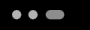

# Omarchy Workspace Dots

An animated Quickshell bar widget for Omarchy Quattro. The focused workspace grows into a pill while the previous one shrinks; the dots move together as the strip changes shape.



## Requirements

- Omarchy Quattro with the Quickshell plugin bar
- No external dependencies or privileged setup

## Install

After publishing this repository, install and enable the plugin, then disable the workspace widget it replaces:

```sh
omarchy plugin add https://github.com/voyagen/oma-dots.git --enable
omarchy plugin disable omarchy.workspaces
```

If you use another workspace widget, disable its ID instead of `omarchy.workspaces`. The dots default to the left section; to move them back there later:

```sh
omarchy bar move voyagen.workspaces-dots --section left
```

## Usage

The bar shows workspaces 1 through the highest occupied or focused workspace, up to 10. Empty workspaces in between keep their dots, so a window on workspace 3 gives you dots for 1, 2, and 3. An empty focused workspace is shown too.

Click a dot to focus its workspace. The active indicator is a 16 px pill; inactive indicators are 8 px circles, with a 6 px gap. The 90 ms grow/shrink animation also moves neighboring dots. Colors follow the active Omarchy theme, and the widget supports horizontal and vertical bars.

## Validate

```sh
omarchy plugin validate ~/.config/omarchy/plugins/voyagen.workspaces-dots
```

For a checkout of this repository, run `omarchy plugin validate .` from its root. To install that checkout locally instead of using `omarchy plugin add`:

```sh
mkdir -p ~/.config/omarchy/plugins/voyagen.workspaces-dots
install -m 644 manifest.json Workspaces.qml ~/.config/omarchy/plugins/voyagen.workspaces-dots/
omarchy-shell shell rescanPlugins
omarchy plugin enable voyagen.workspaces-dots --section left
```

Plugin code normally hot-reloads when saved. If an update does not appear, run `omarchy restart shell`.

## Remove

```sh
omarchy plugin remove voyagen.workspaces-dots --yes
omarchy plugin enable omarchy.workspaces --section left
```

If you previously used a different workspace widget, enable its ID instead. Removing a manually installed plugin backs up its directory.
